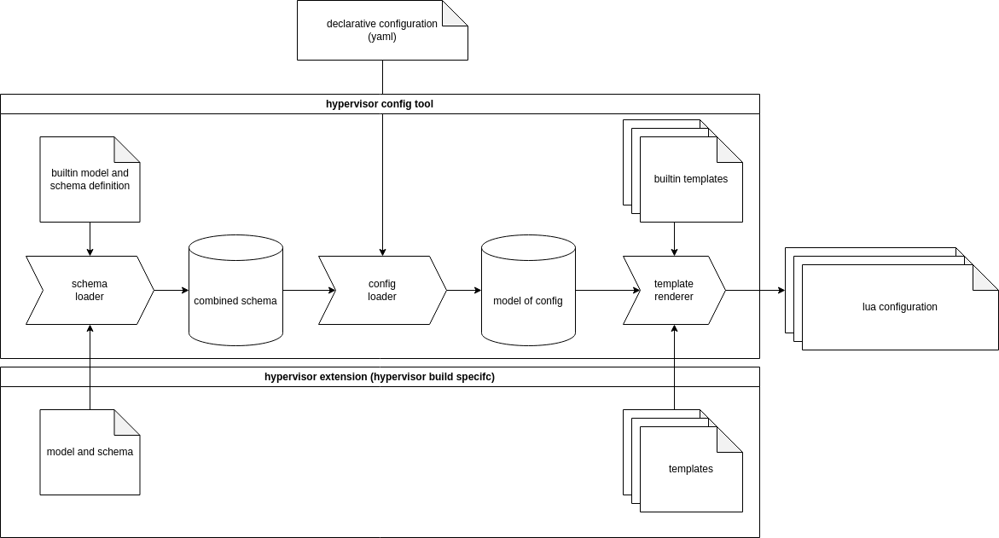

# Hypervisor Config Generator
The hypervisor config generator can create configuration files for the Elektrobit Hypervisor from a declarative configuration in yaml configuration files.

## Background
The Elektrobit hypervisor traditionally is configured using a lua interface.
Configuration of the hypervisor usually consists of:

 * Virtual Machines (e.g. linux) to be started with assigned resources like
   * CPUs
   * RAM
   * Passthrough hardware devices
   * ...
 * Applications running directly on the hypervisor
 * Available physical hardware
 * Virtual hardware like network interface pairs

The configuration using lua is very flexible, but being a full-fledged imperative programming language it is not as straight forward as it could be.

For that reason, the *hypervisor config tool* was created.
It allows generation of the required lua code from a declarative system definition.


Note: In the future the safety relevant applications of the hypervisor will require configuration in a format different from lua (e.g. compiled binary or binary configuration files).
These files have to be created/generated as well which will likely be a part of this tool in the future.

## Overview


The image above shows the main components of the hypervisor config generator and the surrounding elements.
It shows the tooling itself (*hypervisor config tool*), which is the python code and some data (*builtin model*, *schema* and *template*) that is described later.
There is also the user-supplied *declarative configuration* (i.e. it is part of the image description) and the resulting generated *lua configuration*, which is intended to be integrated into the hypervisor image by the surrounding toolchain.
The last part shown here is the optional *hypervisor specialization*.
It can be used to extend or change the model used for the configuration and also replace or extend the configuration files generated.

### Model and Schema
As described in the overview chapter the tool comes with a model and schema definition, that can be extended using a hypervisor specialization.
The main reason for that mechanism is that the hypervisor can provide different features depending on the build (i.e. a hypervisor with and without safety extensions).
These features must be configurable for each supported platform. 
At the time of writing this tool and documentation it does not seem to be viable to integrate all possible features into the tool itself.
As a result, the required features are "outsourced" to an additional package, created together with the hypervisor binaries for the corresponding platform.

In this context the *schema* is a yaml file that describes all possible properties in the configuration file with their datatypes.
It can be compared to [JSON Schema](https://json-schema.org/).
Nevertheless, it is very specific to the hypervisor and limited to required features only.
Everything in the configuration file is either a simple datatype (like string, integer or boolean) an object of a specific type (i.e. a named collection of specified properties) or a list of these.
This schema is then used to parse the configuration file into a python object *model*.
The model can also be extended/overwritten by the hypervisor specialization.
For every named object type defined in the schema a python class exists or is dynamically created.
This allows to add functionality to transform the configuration or derive information using python code.

The schema also defines templates that are rendered into the final lua configuration using the python model in the last step of the tool.
The templates can either be jinja2 templates (ending in .j2), being processed by the tool, or lua code that can be copied directly.


## Usage
The tool always requires the configuration yaml file and the output directory:
```bash
hypervisor_config config.yaml output_dir
```

There are two variants available to hand over a hypervisor specialization:

1. Pass a directory containing the specialization (schema.yaml and/or model.py and templates)
   `hypervisor_config --specialization specialization_dir config.yaml output_dir`
2. Pass a debian package name and a config file that contains repository definitions in the format of the other build tools:
   `hypervisor_config --specialization-package package_name --repo-config repo_config.yaml config.yaml output_dir`.
   This will automatically download the package and use the contained specialization (by searching for a directory with schema.yaml).

The generated config files can then be used to rebuild the hypervisor binary using the l4image tool.

## Reference
### Builtin configuration
This chapter describes the builtin configuration model.
It can be changed or extended by specializations but usually most of the information here should be correct for all hypervisor configurations.

The root of the configuration is the `HVConfig` class.
It has four properties: 

 * *cons*: Configuration for the the console multiplexer
 * *vms*: A list of virtual machines to start
 * *shms*: A list of shared memory segments that can be assigned to virtual machines
 * *vbus*: A list of virtual hardware busses that can be used to pass real hardware to the virtual machines

#### *cons* - Configuration of the console multiplexer
The console multiplexer is used to share a single serial console with multiple users (e.g. VMs).

Currently there is only one configurable option for cons implemented:

 * *default_vm*: This is an optional string and connects the serial terminal to the virtual machine specified here.
   If it is not specified cons is connected to the console multiplexer's command line interface.
   Output is always visible for all clients of the console multiplexer even if the console is connected to one specific VM.

The serial console can be used in a virtual machine by adding a node like this to the device tree:
```c
virtio_uart@20000 {
  compatible = "virtio,mmio";
  reg = <0x20000 0x100>; /* The address can be moved around but should be page aligned (0x1000) */
  interrupt-parent = <&gic>;
  interrupts = <0x0 0x7a 0x4>; /* irq can be set arbitrarily as long as it does not collide */
  l4vmm,vdev = "console"; /* This name is used for matching */
  status = "okay";
};
```
The device will be visible in linux as `/dev/hvcX` with `X` being a number dependent on the order of nodes in the device tree.
I.e. if this is the first `virtio,mmio` node where the device backend defines a serial interface, it will be `hvc0`.

#### *vms* - List of virtual machines
The element is a list of virtual machine descriptions.
All virtual machines defined here are started in the order they are defined.

The following properties are defined for every virtual machine:

 * *name*: A string specifying the name of the virtual machine (used e.g. in console output).
 * *kernel*: A string specifying the name of the kernel binary. (Automatically added to modules.list)
 * *ram*: An integer defining the amount of RAM assigned to the machine in megabyte.
 * *cpus*: An integer specifying the CPU mask for the machine (e.g. 0x13 means CPUS \[0,1,4\] are assigned to the VM).
 * *cmdline*: A string defining the kernel commandline for the linux kernel.
 * *initrd*: An optional string defining the name of the initial ramdisk. (Automatically added to modules.list)
 * *dtb*: A string specifying the name of the binary device tree. (Automatically added to modules.list)
 * *vbus*: An optional string specifying a virtual bus. (See [vbus](#vbus---list-of-virtual-busses))
 * *shms*: A list of strings of names of shared memory segments that are available to the VM. (See [shms](#shms---list-of-shared-memory-segments))
 * *virtio_block*: A list of virtio block devices used to serve a block device from one VM as as virtio block device in another VM. (see [Virtio Block Devices](#virtio-block-devices))
 * *vnets*: A list of strings that create virtual network pair devices. The same name must be used in exactly two virtual machines to create a pair of connected virtio net interfaces in the two VMs.


#### *shms* - List of shared memory segments
Shared memory segments can be used to assign the same physical RAM to more than one virtual machine (or even L4RE applications).
The *shms* property defines a list of shared memory segments with the following properties for each shm segment:

 * *name*: The name of the segment used to reference it in a virtual machine configuration and its device tree.
 * *size*: The size of the segment in bytes.
 * *address*: The optional physical address of the shared memory. If this is not set, a valid address is determined automatically. If the set address is already in use or outside of the RAM, it will trigger an error. Use with caution!

A device tree entry for a shared memory segment `my_shm` looks like this:
```c
my_shm@0 {
  device_type = "memory";
  l4vmm,dscap = "my_shm"; /* reference to the name of the shm */
  reg = <0x0 0 0x0 0x0>;  /* size and address is set automatically */
  status = "okay";
};
```

#### Virtio Block Devices
Virtio block devices allow sharing of a block device from one virtual machine to another.
This allows for example executing the driver for an mmc interface in one linux VM and sharing one partition of that storage device to a different VM.

A virtio serial device (on linux this will be `/dev/hvcX` with `X` being dependent on the device tree) is assigned to the server side and the `vio_filed` application should be used to serve a block device.
On the client side a virtio block device is created. Note: The client VM will not be started until all related servers are served by `vio_filed` daemons.

Definition of virtio block devices is done using the *virtio_block* property in two VMs.
This property is a mapping of a list strings of *servers* and *clients*.
A name for a virtio block device should appear exactly once in the server list of a VM and once in the client list of another VM.

##### Example
```yaml
vms:
  - name: vm1
    virtio_block:
      servers:
        - root
        - data
  - name: vm2
    virtio_block:
      clients:
        - root
        - data
```
This creates two VMs where the first one (`vm1`) serves two virtio block devices that are used in the second vm.
So in `vm1` two instances of `vio_filed` have to be started.

The device tree for `vm1` should specify two serial virtio devices:
```c
  virtio_ser@0 {
    compatible = "virtio,mmio";
    reg = <0x0 0x200>; /* The address can be set arbitrarily, but should not collide and be page aligned */
    interrupt-parent = <&gic>;
    interrupts = <0 0x7c 4>; /* irq numbers can be selected freely as long as they don't collide */
    l4vmm,vdev = "proxy";
    l4vmm,virtiocap = "root_server"; /* name with _server appended */
    status = "okay";
  };

  virtio_ser@1000 {
    compatible = "virtio,mmio";
    reg = <0x1000 0x200>;
    interrupt-parent = <&gic>;
    interrupts = <0 0x7d 4>;
    l4vmm,vdev = "proxy";
    l4vmm,virtiocap = "data_server"; /* name with _server appended */
    status = "okay";
  };
```
The devices will be visible as `/dev/hvcX`. (See [cons](#cons---configuration-of-the-console-multiplexer) for some information on the ordering).

In `vm2`- on the client side - the device tree needs nodes like this:
```c
virtio_block@0 {
  compatible = "virtio,mmio";
  reg = <0x0 0x1000>; /* The address can be set arbitrarily, but should not collide and be page aligned */
  interrupt-parent = <&gic>;
  interrupts = <0 0x60 4>; /* irq numbers can be selected freely as long as they don't collide */
  l4vmm,vdev = "proxy";
  l4vmm,virtiocap = "root_client"; /* name with _client appended */
  status = "okay";
};

virtio_block@1000 {
  compatible = "virtio,mmio";
  reg = <0x1000 0x1000>;
  interrupt-parent = <&gic>;
  interrupts = <0 0x61 4>;
  l4vmm,vdev = "proxy";
  l4vmm,virtiocap = "data_client"; /* name with _client appended */
  status = "okay";
};
```
This will create two `/dev/vdY`devices with `Y` being a letter starting at 'a'.
If these are the only two `virtio,mmio` devices in the device tree backed by a block device, the names will be `vda` for `root` and `vdb` for `data`.


#### *vbus* - List of virtual busses
A *vbus* is a virtual bus that can have an arbitrary amount of devices assigned to it.
Devices are physical devices defined by register addresses and/or interrupts.
The *vbus* can be used to pass the devices to a virtual machine so the virtual machine can access the hardware directly.
Virtual busses are used to aggregate multiple devices together so they can be passed to one virtual machine.

Every vbus has a *name* and an optional  list of *devices* assigned to that bus.

A device has the following properties:

 * *name*: Name of the device used to identify it.
 * *compatible*: Optional compatible string used to match a device tree node to the device defined.
 * *mmios*: An optional list of memory mapped IO addresses. Each entry in the list has the following properties:
   * *address*: An integer describing the mmio address.
   * *size*: An integer describing the size of the mmio region in bytes.
   * *cached*: Optional boolean. If set to true, the memory is mapped as cached normal memory instead of device memory. For real devices this usually should not be set.
 * *irqs*: An optional list of interrupts generated by the device. Each entry in the list has the following properties:
   * *irq*: An integer describing the interrupt number. Note: This defines the interrupt using the same numbering schema as the linux device tree uses (i.e. do not add 32 for SPIs).
   * *type*: An enum describing the type of the interrupt (`SGI`, `PPI`, `SPI`). The default is `SPI` which is used for almost all peripherals on arm.
   * *trigger*: An enum describing the trigger mode of the interrupt, either `level_high` or `rising_edge`.

##### Example
This example shows how to pass the gmac interface on an S32G to a virtual machine.
```yaml
...
vbus:
  - name: s32_gmac
    devices:
      - name:       ethernet_gmac
        compatible: nxp,s32cc-dwmac
        mmios:
          - address: 0x4033c000
            size:    0x2000
          - address: 0x4007c004
            size:    4
        irqs:
          - irq:     57
            trigger: level_high
vms:
  - name: vma
    vbus: s32_gmac
...
```
The configuration defines a vbus `s32_gmac` with one device `ethernet_gmac` with two mmio regions (`0x2000` bytes at `0x4033c000` and `4` bytes at `0x4007c004`) and one SPI interrupt (`57`) with high level trigger behavior.
It is passed to virtual machine `vma`.

A device tree that could be used for that can look like this:
```c
gmac0: ethernet@4033c000 {
	compatible = "nxp,s32cc-dwmac";    /* must be the same as compatible string in device definition */
	reg = <0x0 0x4033c000 0x0 0x2000>, /* first mmio segment */
	      <0x0 0x4007c004 0x0 0x4>;    /* second defined mmio segment */
	interrupt-parent = <&gic>;
	interrupts = <GIC_SPI 57 IRQ_TYPE_LEVEL_HIGH>; /* Same interrupt number as in the device definition */
	/* reduced for brevity in this example */
	status = "okay";
}
```


### Schema
This chapter describes the format of the schema.yaml file.
As written above the schema file describes the hypervisor configuration file.

There are four top level elements in the schema:

 * *version*: At the moment this is always `1`. It will be used when breaking changes are required.
 * *classes*: This describes the available object types of the model.
 * *root*: The type of the root node of the model.
 * *templates*: A list of relative paths to templates that are rendered (`.j2`) or copied to the final configuration folder.

#### Available datatypes
All configuration elements are typed.
There are some datatypes for basic types built into the parser.
These are:

 * *string*: A simple string
 * *integer*: A natural positive or negative number
 * *boolean*: A `True` or `False` value (in yaml format `true` or `false`)

Additional datatypes can be defined using the classes collection in the schema.

#### The *classes* element
The classes element describes a collection of classes used to parse the configuration into.
The collection is a yaml mapping where the key is the name of the class and the value is a mapping of properties to their type.

```yaml
classes:
  VM:
    name:
      type: string
    kernel:
      type: string
    ram:
      type: integer
```
In this example a class `VM` is defined with three properties (`name`, `kernel` and `ram`).
When this type is used and loaded all three values MUST be specified.

##### Properties of classes
In the previous chapter a class is described as a mapping of properties to their type.
A type is also a mapping to allow for more complex type definitions than just scalars.
The following properties are valid in a type definition:

 * *type*: The scalar datatype, a name of a class in the classes collection or `enum`.
 * *optional*: Defaults to `false`. If set to `true` the value may be omitted in the configuration and will be set to the default value.
 * *default*: Defaults to `None`. Can be set to a default value when optional is `true`.
 * *enum_values*: If *type* is set to `enum` a sequence of strings of valid values for the enum. An enum is represented as a string in the python model.
 * *aggregate*: Currently this supports only `list`. If set the parser expects a sequence of objects of the type defined in `type`. This allows for example to define a list of virtual machines.\
  Even for list aggregates a default value can be used. For example for an empty list `[]` can be used. It would also be possible to define one or more objects in the default.

#### The *root* element
The *root* element describes the type expected for the whole configuration file.
This type should be a container for all elements required to configure the hypervisor.
In the builtin schema it is `HVConfig` which is a container that holds virtual machine, device configuration and others.

#### Example

```yaml
version: 1

classes:
  # Define a class called Root
  Root:
    # A simple integer
    simple_int:
      type:     integer
    # An optional string that will have the value "default_value" when not specified
    optional_str:
      type:     string
      optional: true
      default:  default_value
    # A list of boolean that will have the default value [true, false, false] when not specified
    list_of_bool:
      type:      boolean
      aggregate: list
      optional:  true
      default:
       - true
       - false
       - false
    # An enum with valid values: value_a or value_b
    an_enum:
      type:      enum
      enum_values:
       - value_a
       - value_b
    # An optional list of objects from type AnotherObject. Will be None if not specified
    list_of_objects:
      type:      AnotherObject
      aggregate: list
      optional:  true

  # Define a class called AnotherObject ...
  AnotherObject:
    # ... with just one property name as string
    name:
      type:      string

# The root class is the root node
root: Root

# Define templates to be rendered
template:
  - jinja_template.cfg.j2
  - copy_me.lua
```

The schema above can parse this configuration file:
```yaml
simple_int: 42
optional_str: some string
list_of_bool:
  - false
  - false
  - true
an_enum: value_b
list_of_objects:
  - name: object 1
  - name: object 2
```

Parsing this will return an instance of a `Root`-object with the five properties set.
The `list_of_objects` property will contain a list of two `AnotherObject` instances.
This root object is passed to the jinja templates using the variable name `config` and can then be used to render the templates.

Two templates are rendered in this example: 
*jinja_template.cfg.j2* is rendered using jinja2 and will be stored in the output folder as *jinja_template.cfg*. 
*copy_me.lua* is just copied to the output folder.


### Model
In this context, model means the python object model representing the configuration.
It is used to further process and validate the configuration to simplify the process of writing configuration templates in jinja.
One example for processing done in the model is collecting all kernel and device trees into a single list for inclusion into the modules.list that is then used to created the hypervisor binary.

All classes defined in the schema may have a defined python class with the same name.
This is not necessary though, if a class does not exist it is dynamically created.
All model classes must be derived from `BaseModel` which is used for parsing the configuration.


### Hypervisor Specialization
The hypervisor specialization is used to enhance the schema, model and templates used to generate the configuration.
It allows customization depending on the supported features available in the hypervisor binary.
A specialization is a directory containing one or all of `schema.yaml`, `model.py` and templates.


#### Schema specialization
The specialization schema is loaded after the builtin schema and can extend it.
It can add new properties to existing classes, add new classes, change the root class and add/overwrite templates.


##### Example
The example below shows a snipped from the builtin schema and the specialization schema that adds a new property `hi` to the `VM` class and a new template.
This new property can then be used in the template to generate code that is only required if the virtual machine is a high integrity VM.

Builtin schema:
```yaml
...
classes:
  VM:
    name:
      type: string
...
```

Specialization schema:
```yaml
version: 1

classes:
  VM:
    hi:
      type:     boolean
      default:  false
      optional: true

templates:
  - init.ned.j2
```

#### Model specialization
When a specialization contains a `model.py` it is loaded after the builtin module and can overwrite existing classes or add new classes.
This can be used to add properties to the python classes or even add new processing of the configuration.
It is also possible to extend the existing classes by inheritance.

##### Example
This example shows how a validation step can be integrated for the schema extension defined below.
In this hypothetical example a high integrity VM always requires the shared memory segments named `fbshm`, `proxycomshm`, `hicomshm`, `tmshm` and `wdgshm`.


```py
from ebcl.tools.hypervisor.model_gen import ConfigError
from ebcl.tools.hypervisor.model import VM as VMBase

class VM(VMBase):
  HI_EXPECTED_SHMS = set((
    "fbshm",
    "proxycomshm",
    "hicomshm",
    "tmshm",
    "wdgshm"
  ))
  hi: bool
  """True if this is a high integrity VM"""

  def finalize(self, registry: HVConfig) -> None:
    super().finalize(registry)
    shm_names = [shm.name for shm in self.shms]
    missing = self.HI_EXPECTED_SHMS.difference(shm_names)
    if missing:
      raise ConfigError(f"For a hi VM the following shms are missing: {', '.join(missing)}")
```
The specialization model derives the class `VM` from the builtin `VM` class and adds a validation step to the `finalize` method.
Note that the `finalize` method is not (yet) called for all classes defined in the model.
